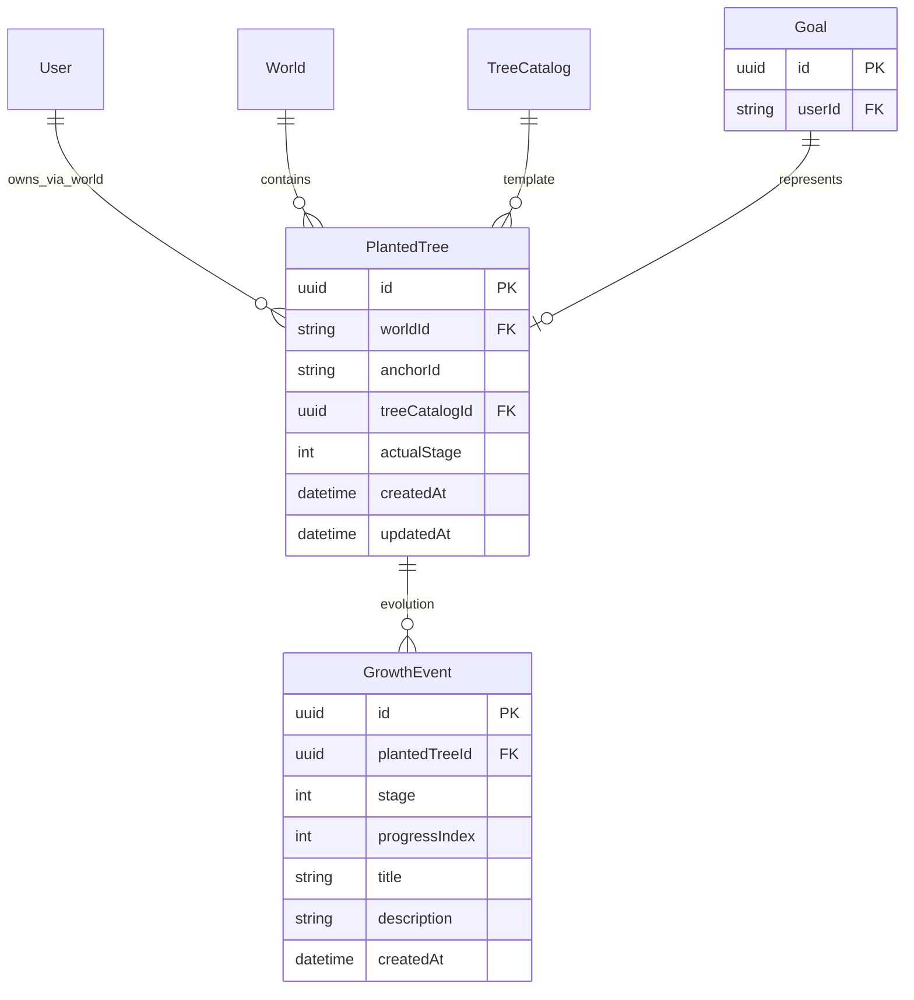
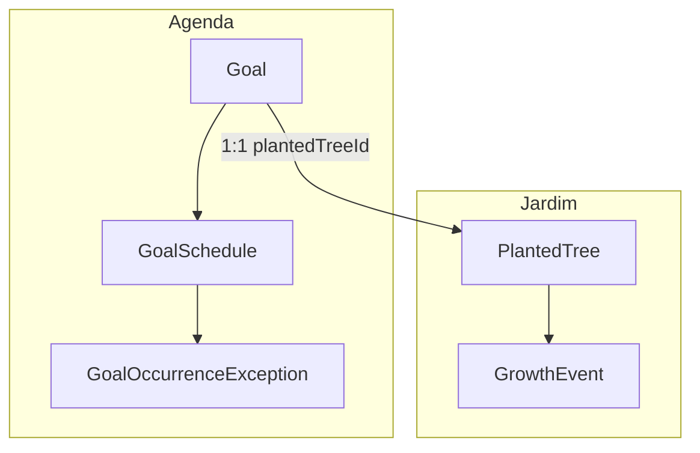

# Plano: ER separando Árvores (jogo) e Agenda (metas + recorrência)

Escopo: *somente visão de banco / relacionamentos* para o backend. Nomes de tabela são sugestão; ao implementar no Prisma, alinhar a convenção do projeto (PascalCase modelos).

---

## Princípio de separação

| Área                 | Responsabilidade                                                                                                          | O que *não* entra aqui                                  |
| -------------------- | ------------------------------------------------------------------------------------------------------------------------- | --------------------------------------------------------- |
| *Jardim (árvores)* | Qual árvore representa qual meta; estágio; histórico de evolução ao concluir/progredir                                    | Lembretes, contagem, dailyStatus, regras de recorrência |
| *Agenda (metas)*   | Título, tipo pontual/contínua, categoria, *agenda* (uma vez / diária / semanal / mensal), lembretes, estado operacional | actualStage, SVG, anchor visual                         |

A ponte é *1 meta na Agenda ↔ no máximo 1 árvore plantada* (PlantedTree.goalId *ou* Goal.plantedTreeId — escolha um lado para FK; abaixo usamos **Goal.plantedTreeId** opcional para espelhar o padrão atual do [UserGoal](../prisma/schema.prisma), invertível se preferirem árvore dona da FK).

---

## 1) Banco relacional simples: árvores + evolução

Objetivo: só *identidade da árvore no mundo* + *eventos de crescimento* quando o usuário conclui / evolui a meta.



*Notas:*

- GrowthEvent permanece como hoje no [schema.prisma](../prisma/schema.prisma:101-111): trilha de evolução *sem* saber de lembretes.
- A relação *Goal ↔ PlantedTree* deve ser *1:1* (uma meta, uma árvore). Restrição: UNIQUE(goalId) em PlantedTree *ou* UNIQUE(plantedTreeId) em Goal.
- World / TreeCatalog ficam como estão; só entra o vínculo explícito com Goal no lugar do vínculo atual UserGoal.plantedTreeId.

---

## 2) Parte "estilo Google Agenda": metas + série + exceções

Conceitos alinhados ao modelo mental do Google Calendar:

- *Meta pontual* = uma ocorrência fixa (sem recorrência), ou série com uma única data.
- *Meta contínua* = *série recorrente* (diária, semanal, mensal) definida num *registro mestre* de agenda.
- *Alterar só este dia* = *exceção* amarrada à série + *instante original* da ocorrência (originalStart / recurrenceId semântico).
- *Alterar todos* = atualizar o *registro mestre* da série (e opcionalmente limpar exceções futuras, conforme regra de produto).

```mermaid
erDiagram
  User ||--o{ Goal : has
  Goal ||--o| GoalSchedule : series_rule
  Goal ||--o{ GoalReminder : reminders
  Goal ||--o{ GoalOccurrenceException : single_edits
  GoalSchedule ||--o{ GoalOccurrenceException : applies_to

  Goal {
    uuid id PK
    string userId FK
    string title
    string description
    string conquestType
    enum goalKind
    uuid plantedTreeId FK UK
    enum status
    datetime createdAt
    datetime updatedAt
  }

  GoalSchedule {
    uuid id PK
    uuid goalId FK UK
    enum frequency
    string timeZone
    datetime dtStart
    datetime dtEnd
    string rrule
    date seriesEndDate
    json extra
    datetime createdAt
    datetime updatedAt
  }

  GoalOccurrenceException {
    uuid id PK
    uuid goalId FK
    uuid scheduleId FK
    datetime originalOccurrenceStart
    boolean isCancelled
    string titleOverride
    datetime startOverride
    datetime endOverride
    json payloadOverride
    datetime createdAt
    datetime updatedAt
  }

  GoalReminder {
    uuid id PK
    uuid goalId FK
    int minutesBefore
    datetime createdAt
  }
```

*Campos-chave (sem prescrever implementação de RRULE):*

- **Goal.goalKind**: ex. PONTUAL | CONTINUA (compatível com goalType atual).
- **GoalSchedule.frequency**: ONCE | DAILY | WEEKLY | MONTHLY (e eventualmente YEARLY se precisarem).
- **dtStart / dtEnd**: âncora temporal da série (fuso em timeZone IANA, como [User.timezone](../prisma/schema.prisma:8)).
- **rrule**: string RFC 5545 **ou** vazio quando frequency=ONCE e tudo estiver em dtStart/dtEnd.
- **GoalOccurrenceException**: para "editar pontualmente" — uma linha por ocorrência alterada; originalOccurrenceStart identifica **qual** instância da série foi tocada (equivalente a RECURRENCE-ID + início original). isCancelled cobre "apagar só este".
- *"Alterar para todos"*: UPDATE em Goal / GoalSchedule, **sem** linha em GoalOccurrenceException (ou recalculo explícito que invalida exceções antigas, decisão de produto).

*Lembretes e operação diária* (slots enviados, dailyStatus, etc.): podem ficar em colunas em Goal (como hoje em UserGoal) *ou* tabelas auxiliares (GoalReminder, GoalDeliveryState) — importante: *fora* de PlantedTree / GrowthEvent.

---

## 3) Fluxo de dados (visão única)



- *Dashboard dia/semana/mês*: lê Goal + GoalSchedule, expande ocorrências no intervalo da vista, aplica GoalOccurrenceException por originalOccurrenceStart.
- *Usuário conclui / evolui*: escreve em GrowthEvent (e atualiza PlantedTree.actualStage); opcionalmente atualiza estado em Goal se ainda usarem completed por meta pontual.

---

## 4) Migração a partir do estado atual

Hoje [UserGoal](../prisma/schema.prisma:30-53) concentra agenda + FK para PlantedTree. O caminho natural:

1. Renomear / criar Goal com os campos de agenda migrados de UserGoal.
2. Manter plantedTreeId em Goal (1:1).
3. Extrair scheduleConfig JSON para GoalSchedule (parse once → ONCE, daily/weekly → DAILY/WEEKLY + campos ou rrule gerado).
4. PlantedTree deixa de ser referenciado por UserGoal e passa a ser referenciado só por Goal.

---

## 5) Índices sugeridos (PostgreSQL)

- Goal(userId, createdAt)
- GoalSchedule(goalId) (único 1:1 se uma série por meta)
- GoalOccurrenceException(scheduleId, originalOccurrenceStart) **UNIQUE** para não duplicar exceção na mesma ocorrência
- PlantedTree(goalId) **UNIQUE** se a FK estiver na árvore

---

## Resumo

- *Árvores*: modelo enxuto — PlantedTree + GrowthEvent, ligados a **uma** Goal por vínculo 1:1.
- *Agenda*: Goal + GoalSchedule (regra mestre: pontual / diária / semanal / mensal) + GoalOccurrenceException para mudanças só numa data; mudanças na série inteira atualizam Goal/GoalSchedule.

Isso cobre o que você descreveu sem colocar lembretes ou recorrência no modelo da árvore.
